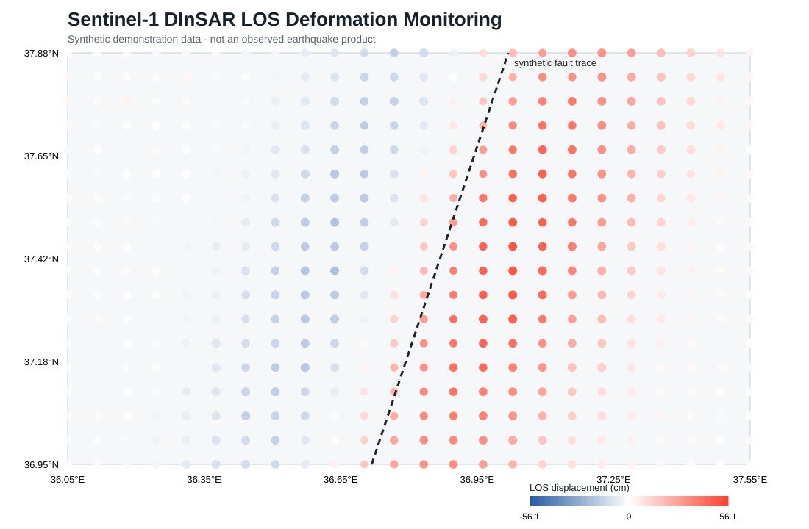

# Sentinel-1 InSAR Deformation Monitoring

[](https://github.com/7ao6688-hash/insar-deformation-monitoring/actions/workflows/ci.yml)
[](https://www.python.org/)
[](LICENSE)

A reproducible research software project for analysing and communicating line-of-sight (LOS) ground deformation derived from Sentinel-1 DInSAR products. The pipeline turns geocoded displacement point exports into quality-controlled statistics, an along-fault profile, a machine-readable summary and an SVG deformation map.

> The repository includes a **synthetic demonstration dataset**, not measurements from a real earthquake. The workflow is designed so that a geocoded displacement export from ESA SNAP/SNAPHU can be substituted without changing the analysis code.



## Why this project

Interferometric SAR products are technically rich but difficult to communicate. This repository demonstrates the downstream engineering needed to transform an unwrapped, geocoded displacement product into repeatable evidence:

- schema and range validation;
- robust and coherence-weighted deformation statistics;
- configurable alert thresholds;
- cross-fault profiles with bootstrap intervals;
- phase-to-displacement and phase-noise precision calculations;
- optional coherence-weighted planar-ramp modelling;
- dependency-free SVG visualisation;
- deterministic tests and continuous integration.

## Demonstrated skills

`Sentinel-1` · `DInSAR` · `ESA SNAP` · `SNAPHU` · `Python` · `geospatial data validation` · `LOS displacement analysis` · `scientific visualisation` · `reproducible workflows`

## Quick start

Requires Python 3.10 or later. No third-party Python packages are required.

```bash
python scripts/run_demo.py
```

After installing the package with `python -m pip install -e .`, the equivalent command is:

```bash
insar-monitor demo --output-dir output/demo
```

The demo creates:

```text
output/demo/
├── synthetic_los_displacement.csv
├── summary.json
├── cross_fault_profile.csv
└── deformation_map.svg
```

Analyse another point export:

```bash
python -m insar_monitor analyse data/my_los_points.csv --output-dir output/my_run --threshold-cm 10
```

Input schema:

| Column | Unit | Description |
|---|---:|---|
| `longitude` | degrees | WGS84 longitude |
| `latitude` | degrees | WGS84 latitude |
| `los_displacement_cm` | cm | Signed satellite line-of-sight displacement |
| `coherence` | 0–1 | Interferometric coherence |
| `distance_to_fault_km` | km | Signed distance used for the cross-fault profile |

## Processing context

The Python workflow begins after interferogram processing. A typical upstream Sentinel-1 DInSAR chain is:

1. Apply precise orbit files and split TOPS subswaths.
2. Co-register the master and slave scenes using back-geocoding.
3. Form and deburst the interferogram.
4. Remove topographic phase using an external DEM.
5. Apply Goldstein phase filtering.
6. Unwrap phase with SNAPHU.
7. Convert unwrapped phase to LOS displacement.
8. Terrain-correct and export valid pixels or sampled points.
9. Run this repository's validation, statistics and reporting pipeline.

See [the processing notes](docs/processing-workflow.md) for assumptions, limitations and quality-control guidance.
The statistical models and uncertainty scope are documented in [the analysis methodology](docs/methodology.md). A machine-readable [run metadata template](config/example_run_metadata.json) records source products, geometry, processing parameters and validation evidence.

## Quality controls

The analyser rejects records when coordinates are outside WGS84 bounds, coherence falls outside 0–1, numeric values are missing, or required columns are absent. Low-coherence observations can be filtered at analysis time.

```bash
python -m unittest discover -s tests -v
python scripts/run_demo.py
```

## Synthetic demonstration

The demonstration field represents a simplified two-sided fault displacement pattern. It is useful for testing code and visual design, but it must not be cited as an observed event result. The generated `summary.json` records provenance as `synthetic`.

## Adapting it to a real case study

- Export geocoded LOS displacement and coherence from SNAP as CSV or convert a GeoTIFF to the documented schema.
- Record scene identifiers, acquisition dates, orbit direction, wavelength, DEM and unwrapping parameters in run metadata.
- Mask water, layover/shadow and low-coherence pixels before interpretation.
- Compare against GNSS or published products where available.
- Avoid interpreting LOS displacement as pure vertical motion without a justified decomposition.

## Licence

MIT. See [LICENSE](LICENSE).
